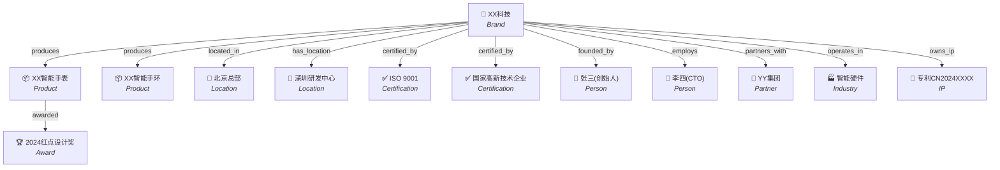

# 品牌知识图谱 (geo-brand-graph)

## 概述

本技能用于构建品牌实体关系图（Brand Entity Relationship Graph），将品牌及其关联实体组织为可被AI搜索引擎理解的结构化知识图谱。AI搜索引擎（如Google Knowledge Graph、Bing Entity Search、ChatGPT实体识别）对品牌的理解依赖于结构化的实体-关系-实体三元组。通过本技能，品牌信息将以AI最易消化的形式呈现和集成。

## 核心原则

1. **实体原子化**：每个实体（品牌、产品、人物、地点、认证）都是独立可引用的节点
2. **关系显式化**：实体间的关系用标准谓词（produces, located_in, certified_by等）明确表达
3. **三元组标准化**：所有知识以 [实体A] → [关系] → [实体B] 形式组织
4. **可序列化输出**：同时生成可视化（Mermaid）、结构化数据（JSON-LD）、机器可读格式（三元组）

## 实体类型定义

### 实体分类体系

| 实体类型 | 标识 | 示例 | 提取来源 |
|----------|------|------|----------|
| 品牌/组织 (Brand) | `brand` | XX科技有限公司、XX口腔 | 官网、营业执照 |
| 产品 (Product) | `product` | XX智能手表、儿童早矫套餐 | 产品页、文档 |
| 服务 (Service) | `service` | 牙齿矫正、企业咨询 | 服务页、案例 |
| 地理位置 (Location) | `location` | 北京市朝阳区XX路、上海总部 | 联系页面、地图 |
| 认证/资质 (Certification) | `certification` | ISO 9001、国家高新技术企业 | 资质页、证书 |
| 奖项/荣誉 (Award) | `award` | 2024年度最佳品牌、红点设计奖 | 新闻、公告 |
| 关键人物 (Person) | `person` | 创始人、CTO、首席设计师 | 团队页面、LinkedIn |
| 合作伙伴 (Partner) | `partner` | 供应商、渠道商、战略合作伙伴 | 合作公告、案例 |
| 知识产权 (IP) | `ip` | 专利、商标、著作权、软著 | 知识产权声明 |
| 媒体覆盖 (Media) | `media` | 新闻报道、行业媒体报道 | 新闻、PR |
| 行业/领域 (Industry) | `industry` | 医疗器械、教育培训、SaaS | 品牌资料、分类 |
| 内容资产 (ContentAsset) | `content_asset` | 白皮书、研究报告、案例研究 | 内容中心、下载页 |

### 实体属性模板

每个实体提取时包含以下属性：

```
- entity_id: [唯一标识符，格式: {type}_{slug}]
- entity_type: [类型]
- name: [标准名称]
- aliases: [别名/简称列表]
- description: [一句话描述（30字内）]
- url: [实体官方页面URL]
- same_as: [同一实体的其他权威来源URL，如Wikipedia、天眼查、行业数据库]
```

## 关系类型定义

### 标准关系谓词

| 关系谓词 | 源实体类型 → 目标实体类型 | 说明 | 示例 |
|----------|--------------------------|------|------|
| `produces` | Brand → Product | 品牌生产/提供某产品 | XX科技 produces XX智能手表 |
| `offers_service` | Brand → Service | 品牌提供某服务 | XX口腔 offers_service 牙齿矫正 |
| `located_in` | Brand → Location | 品牌位于某地 | XX科技 located_in 北京市海淀区 |
| `has_location` | Brand → Location | 品牌拥有分支机构 | XX口腔 has_location 上海静安门诊部 |
| `certified_by` | Brand/Product → Certification | 品牌/产品获得某认证 | XX产品 certified_by ISO 9001 |
| `awarded` | Brand/Product → Award | 品牌/产品获得某奖项 | XX科技 awarded 国家高新技术企业 |
| `founded_by` | Brand → Person | 品牌由某人创立 | XX科技 founded_by 张三 |
| `employs` | Brand → Person | 品牌雇用某关键人物 | XX科技 employs 李四(CTO) |
| `partners_with` | Brand → Partner | 品牌与某组织合作 | XX科技 partners_with YY集团 |
| `owns_ip` | Brand → IP | 品牌拥有某知识产权 | XX科技 owns_ip 专利CN2024XXXXXX |
| `covered_by` | Brand/Product → Media | 品牌/产品被媒体报道 | XX产品 covered_by 36氪报道 |
| `operates_in` | Brand → Industry | 品牌运营于某行业 | XX科技 operates_in 企业服务 |
| `publishes` | Brand → ContentAsset | 品牌发布某内容资产 | XX科技 publishes 2024行业白皮书 |
| `competitor_of` | Brand → Brand | 品牌之间的竞争关系 | XX科技 competitor_of ZZ科技 |
| `parent_of` | Brand → Brand | 母子公司关系 | XX集团 parent_of XX科技 |
| `variant_of` | Product → Product | 产品变体关系 | XX手表Pro variant_of XX手表 |
| `compatible_with` | Product → Product | 产品兼容关系 | XX耳机 compatible_with XX手机 |

### 自定义关系扩展

如果标准谓词无法准确描述关系，可定义自定义关系，但需：
1. 使用 `snake_case` 命名
2. 在输出中附带关系定义说明
3. 优先复用schema.org已有关系类型

## 知识图谱构建工作流

### 第一步：实体发现与提取

从品牌资料包（由 `geo-brand-intake` 产出）中提取所有实体：

```
输入：品牌事实资料包
过程：
  1. 扫描品牌名 → 创建 brand 实体
  2. 扫描产品/服务名 → 创建 product/service 实体
  3. 扫描地理位置 → 创建 location 实体
  4. 扫描认证/资质/奖项 → 创建 certification/award 实体
  5. 扫描关键人物 → 创建 person 实体
  6. 扫描合作伙伴 → 创建 partner 实体
  7. 扫描知识产权 → 创建 ip 实体
  8. 扫描媒体覆盖 → 创建 media 实体
  9. 确定行业领域 → 创建 industry 实体
  10. 扫描内容资产 → 创建 content_asset 实体
```

### 第二步：关系推导

基于实体间的逻辑联系，推导关系三元组：

```
关系推导规则：
  - 品牌 + 产品 → produces
  - 品牌 + 服务 → offers_service
  - 品牌 + 地址 → located_in 或 has_location
  - 品牌 + 认证 → certified_by
  - 品牌 + 奖项 → awarded
  - 品牌 + 创始人 → founded_by
  - 品牌 + 关键员工 → employs
  - 品牌 + 合作方 → partners_with
  - 品牌 + 专利/商标 → owns_ip
  - 品牌 + 报道 → covered_by
  - 品牌 + 行业 → operates_in
  - 品牌 + 白皮书/报告 → publishes
```

### 第三步：去重与规范化

```
- 同一实体多次出现时合并为一个节点
- 使用标准名称（非简称），别名记录在 aliases 字段
- 同一URL指向的实体合并处理
- 确保无孤立实体（每个实体至少出现在一个三元组中）
```

### 第四步：生成Mermaid实体关系图



### 第五步：生成JSON-LD结构化数据

输出符合Schema.org规范的JSON-LD，可直接嵌入网站 `<head>` 或知识图谱API：

```json
{
  "@context": "https://schema.org",
  "@graph": [
    {
      "@id": "https://example.com/#brand",
      "@type": "Organization",
      "name": "XX科技有限公司",
      "alternateName": ["XX科技", "XX Tech"],
      "description": "专注于智能穿戴设备的科技企业",
      "url": "https://example.com",
      "logo": "https://example.com/logo.png",
      "foundingDate": "2018-03-15",
      "founder": {
        "@type": "Person",
        "name": "张三",
        "jobTitle": "创始人兼CEO"
      },
      "employee": {
        "@type": "Person",
        "name": "李四",
        "jobTitle": "CTO"
      },
      "address": {
        "@type": "PostalAddress",
        "addressLocality": "北京",
        "addressRegion": "海淀区",
        "addressCountry": "CN"
      },
      "parentOrganization": null,
      "subOrganization": [
        {
          "@type": "Organization",
          "name": "XX科技深圳研发中心",
          "address": {
            "@type": "PostalAddress",
            "addressLocality": "深圳",
            "addressRegion": "南山区"
          }
        }
      ],
      "makesOffer": [
        {
          "@type": "Offer",
          "itemOffered": {
            "@id": "https://example.com/#product-1"
          }
        },
        {
          "@type": "Offer",
          "itemOffered": {
            "@id": "https://example.com/#product-2"
          }
        }
      ],
      "hasCredential": [
        {
          "@type": "EducationalOccupationalCredential",
          "name": "ISO 9001质量管理体系认证"
        },
        {
          "@type": "EducationalOccupationalCredential",
          "name": "国家高新技术企业"
        }
      ],
      "award": [
        "2024红点设计奖"
      ]
    },
    {
      "@id": "https://example.com/#product-1",
      "@type": "Product",
      "name": "XX智能手表",
      "description": "旗舰级智能手表，支持健康监测和运动追踪",
      "url": "https://example.com/products/watch",
      "brand": { "@id": "https://example.com/#brand" },
      "award": "2024红点设计奖"
    },
    {
      "@id": "https://example.com/#product-2",
      "@type": "Product",
      "name": "XX智能手环",
      "description": "轻量级智能手环，长续航健康伴侣",
      "url": "https://example.com/products/band",
      "brand": { "@id": "https://example.com/#brand" }
    }
  ]
}
```

### 第六步：生成实体三元组

输出用于知识图谱集成的标准三元组：

```csv
subject, predicate, object
entity_id_1, relation_type, entity_id_2
---
brand_xx-tech, produces, product_xx-watch
brand_xx-tech, produces, product_xx-band
brand_xx-tech, located_in, location_beijing-hq
brand_xx-tech, has_location, location_shenzhen-rd
brand_xx-tech, certified_by, cert_iso-9001
brand_xx-tech, certified_by, cert_high-tech-enterprise
brand_xx-tech, founded_by, person_zhangsan
brand_xx-tech, employs, person_lisi
brand_xx-tech, partners_with, partner_yy-group
brand_xx-tech, operates_in, industry_smart-hardware
brand_xx-tech, owns_ip, ip_patent-cn2024xxxx
product_xx-watch, awarded, award_reddot-2024
product_xx-watch, variant_of, product_xx-watch-lite
product_xx-watch, compatible_with, product_xx-band
```

同时生成RDF/Turtle格式可选输出（适用于高级知识图谱场景）：

```turtle
@prefix schema: <https://schema.org/> .
@prefix ex: <https://example.com/ns#> .

ex:brand_xx-tech
  ex:produces ex:product_xx-watch ;
  ex:produces ex:product_xx-band ;
  schema:location ex:location_beijing-hq ;
  ex:certified_by ex:cert_iso-9001 .
```

## 输出格式：品牌知识图谱文档

完成所有步骤后，输出以下完整知识图谱文档：

```markdown
# [品牌名] — 品牌知识图谱

## 1. 实体清单（Entity Catalog）

| Entity ID | 类型 | 名称 | 别名 | 描述 | URL |
|-----------|------|------|------|------|-----|
| brand_xx-tech | Brand | XX科技有限公司 | XX科技, XX Tech | 专注于... | https://example.com |
| product_xx-watch | Product | XX智能手表 | — | 旗舰级... | https://example.com/products/watch |
| ... | ... | ... | ... | ... | ... |

## 2. 关系三元组（Relation Triplets）

| # | 源实体 | 关系 | 目标实体 |
|---|--------|------|----------|
| 1 | XX科技 | produces | XX智能手表 |
| 2 | XX科技 | located_in | 北京总部 |
| ... | ... | ... | ... |

## 3. 实体关系图（Mermaid ER Diagram）

[Mermaid代码块]

## 4. JSON-LD结构化数据

[完整JSON-LD代码块，可直接嵌入网站]

## 5. 三元组导出（CSV）

[CSV格式三元组列表]

## 6. 知识图谱集成建议

- **Google Knowledge Graph API**: 使用 JSON-LD 集成
- **内部知识库**: 使用 CSV 三元组导入
- **网站Schema标记**: 将JSON-LD嵌入所有关键页面
- **AI训练语料优化**: 使用三元组指导内容中的实体标注

## 7. 实体覆盖率审计

| 实体类型 | 应有数量 | 已提取数量 | 覆盖率 | 缺失项 |
|----------|----------|-----------|--------|--------|
| Brand | 1 | 1 | 100% | — |
| Product | ? | N | XX% | [缺失产品列表] |
| ... | ... | ... | ... | ... |
```

## 特殊场景处理

### 多品牌/集团品牌

- 使用 `parent_of` / `subsidiary_of` 关系连接母子品牌
- 每个子品牌独立创建实体节点
- 共享实体（如共用认证）建立双向关系

### 服务型品牌（无实物产品）

- 服务作为 `Service` 实体类型
- 使用 `offers_service` 而非 `produces`
- 使用 `serves_area` 关系标注服务覆盖区域

### 个人品牌/IP型品牌

- 个人作为核心 `Person` 实体，同时创建 `Brand` 实体
- 使用 `represents` 关系连接个人和品牌实体
- 个人属性（教育背景、著作、社交媒体）作为实体属性

### 有大量产品的品牌

- 按产品线或类别创建中间层实体（Category → Product）
- 重点标注旗舰产品和差异化产品
- 非核心产品可降级为实体属性（不创建独立节点）

## 跨平台使用说明

本技能为纯文本指令集，可在任何支持Markdown的AI代理平台使用。使用时：
- 将本SKILL.md的内容作为系统指令加载
- 提供品牌资料包或品牌基本信息
- 按六步工作流完成知识图谱构建
- 输出包含Mermaid图、JSON-LD、三元组的完整文档
- 所有实体类型、关系谓词、模板均内嵌于文档中，无需外部依赖
